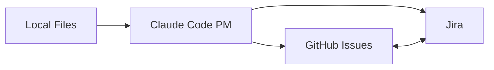

# Getting Started with Jira Integration

Welcome to Claude Code PM's Jira integration! This guide will walk you through setting up and using Jira with your Claude Code PM workflow.

## Table of Contents

1. [Prerequisites](#prerequisites)
2. [Quick Start](#quick-start)
3. [Initial Setup](#initial-setup)
4. [Your First Jira-Integrated Epic](#your-first-jira-integrated-epic)
5. [Understanding the Integration](#understanding-the-integration)
6. [Common Workflows](#common-workflows)
7. [Tips for Success](#tips-for-success)
8. [Troubleshooting](#troubleshooting)
9. [Next Steps](#next-steps)

## Prerequisites

Before you begin, ensure you have:

1. **Claude Code PM installed** in your project
   ```bash
   # Check if installed
   ls -la .claude/commands/pm/
   ```

2. **GitHub CLI authenticated**
   ```bash
   gh auth status
   ```

3. **Jira account** with:
   - API access enabled
   - Permission to create issues in your project
   - An API token (create at: https://id.atlassian.com/manage-profile/security/api-tokens)

## Quick Start

For experienced users, here's the fastest way to get started:

```bash
# 1. Set environment variables
export JIRA_API_TOKEN="your-api-token"
export JIRA_USER_EMAIL="you@company.com"
export JIRA_SITE_URL="https://company.atlassian.net"

# 2. Initialize with Jira
/pm:init

# 3. Create and sync your first epic
/pm:prd-new my-feature
/pm:prd-parse my-feature
/pm:epic-oneshot my-feature

# 4. Start working
/pm:next
```

## Initial Setup

### Step 1: Create Your Jira API Token

1. Go to [Atlassian API Tokens](https://id.atlassian.com/manage-profile/security/api-tokens)
2. Click "Create API token"
3. Give it a name like "Claude Code PM"
4. Copy the token (you won't see it again!)

### Step 2: Configure Environment Variables

Add these to your shell profile (`.bashrc`, `.zshrc`, etc.):

```bash
# Required Jira configuration
export JIRA_API_TOKEN="atatt_your-token-here"
export JIRA_USER_EMAIL="john.doe@company.com"
export JIRA_SITE_URL="https://yourcompany.atlassian.net"

# Optional: Default project key
export JIRA_PROJECT_KEY="PROJ"
```

**Security Note:** Never commit these values to your repository!

### Step 3: Initialize Claude Code PM with Jira

```bash
/pm:init
```

You'll see:
```
🚀 Initializing Claude Code PM...
✅ GitHub CLI authenticated
🔧 Configuring Jira integration...
   Site: https://yourcompany.atlassian.net
   User: john.doe@company.com
   Testing connection...
✅ Jira connection successful!
   Available projects: PROJ, TEAM, INFRA
   
Enter default project key [PROJ]: PROJ
✅ Configuration saved to claude/settings.local.json
```

### Step 4: Verify Your Setup

Test that everything is working:

```bash
/pm:search --jira "test"
```

If you see results from Jira, you're ready to go!

## Your First Jira-Integrated Epic

Let's walk through creating a complete feature with Jira integration:

### 1. Create a Product Requirements Document

```bash
/pm:prd-new user-notifications
```

This launches an interactive brainstorming session. Be thorough – this document drives everything else!

### 2. Parse PRD into Technical Epic

```bash
/pm:prd-parse user-notifications
```

This creates:
- Technical implementation plan
- Architectural decisions
- Task breakdown structure

### 3. Create Tasks in Both Systems

```bash
/pm:epic-oneshot user-notifications
```

This powerful command:
1. Decomposes the epic into tasks
2. Creates a Jira Epic (e.g., PROJ-100)
3. Creates Jira Stories for each task
4. Creates corresponding GitHub issues
5. Links everything bidirectionally
6. Creates a git worktree for development

You'll see output like:
```
✅ Created in GitHub:
   Epic: #1234 - User Notifications
   Tasks: #1235-1240 (6 tasks)

✅ Created in Jira:
   Epic: PROJ-100
   Stories: PROJ-101 to PROJ-106

✅ Worktree: ../epic-user-notifications
```

### 4. Start Your First Task

```bash
/pm:next
```

This intelligently suggests your next task based on:
- Dependencies
- Sprint priorities
- Current workload
- Blockers

Then start work:
```bash
/pm:issue-start 1235
```

This:
- Updates Jira status to "In Progress"
- Creates a properly named branch
- Loads context for the agent
- Prepares the workspace

### 5. Track Progress

As you work, sync updates:

```bash
# After making progress
/pm:issue-sync 1235
```

This posts updates to both GitHub and Jira, keeping everyone informed.

### 6. Complete the Task

```bash
/pm:issue-close 1235 --create-pr
```

This:
- Creates a pull request
- Updates Jira to "Done"
- Closes the GitHub issue
- Links everything together

## Understanding the Integration

### How It Works



1. **Local First**: All work starts in local files (`.claude/epics/`)
2. **Dual Sync**: Changes push to both GitHub and Jira
3. **Bidirectional**: Updates in either system sync back
4. **Single Source of Truth**: Your code and local files

### Key Concepts

**Issue Linking**
- Every GitHub issue links to a Jira issue
- Issue numbers map: #1235 ↔ PROJ-101
- Links stored in issue descriptions

**Status Mapping**
- GitHub "open" = Jira "To Do" or "In Progress"
- GitHub "closed" = Jira "Done"
- Custom mappings in settings

**Smart Search**
- Natural language queries search everywhere
- Results merged and deduplicated
- JQL/CQL for advanced queries

## Common Workflows

### Daily Standup

Start your day with:

```bash
/pm:standup
```

Shows:
- Yesterday's progress (both systems)
- Today's priorities
- Current blockers
- Team velocity

### Finding Work

```bash
# What should I work on?
/pm:next

# What's in my sprint?
/pm:search "my tasks in current sprint"

# What's blocked?
/pm:blocked
```

### Collaborative Development

```bash
# Check epic status
/pm:epic-status user-notifications

# See who's working on what
/pm:search "status = 'In Progress'"

# Find related work
/pm:search "authentication" --format markdown
```

### Sprint Planning

```bash
# Find unestimated stories
/pm:search --jql "project = PROJ AND 'Story Points' is EMPTY"

# Check velocity
/pm:search --jql "sprint = 'Sprint 23' AND status = Done"
```

## Tips for Success

### 1. Commit Messages Matter

Always include the Jira key in commits:
```bash
git commit -m "PROJ-101: Implement user authentication"
```

This creates automatic links in Jira!

### 2. Use Saved Searches

Create reusable searches:
```bash
/pm:search --save-as "my-sprint" "assignee = me AND sprint in openSprints()"
/pm:search --saved my-sprint
```

### 3. Keep Systems Aligned

Run weekly:
```bash
/pm:validate
```

This finds and fixes sync issues.

### 4. Leverage Parallel Work

The worktree system allows multiple agents:
```bash
cd ../epic-user-notifications
# Multiple agents can work here simultaneously
```

### 5. Document in Context

Keep notes in update files:
```bash
# In .claude/epics/user-notifications/updates/1235.md
- Completed API endpoint
- Need security review
- Blocked on design approval
```

## Troubleshooting

### Connection Issues

```bash
# Test connection
curl -u "$JIRA_USER_EMAIL:$JIRA_API_TOKEN" \
  "$JIRA_SITE_URL/rest/api/3/myself"

# Check configuration
cat claude/settings.local.json | jq .jira
```

### Sync Problems

```bash
# Force refresh
/pm:epic-refresh user-notifications

# Check for issues
/pm:validate

# Manual sync
/pm:issue-sync 1235 --force
```

### Common Errors

**"Jira API rate limit exceeded"**
- Wait 60 seconds
- Check `docs/api-limits.md` for details

**"Issue not found in Jira"**
- Run `/pm:validate` to fix links
- Check project permissions

**"Status transition not allowed"**
- Check Jira workflow settings
- Update transition mapping in settings

### Debug Mode

For detailed logs:
```bash
DEBUG=1 /pm:issue-sync 1235
```

## Next Steps

Now that you're set up:

1. **Explore Advanced Features**
   - Read [Jira Examples](jira-examples.md) for complex scenarios
   - Check [Workflows](workflows.md) for best practices

2. **Customize Your Setup**
   - Edit `claude/settings.local.json`
   - Map custom fields
   - Configure transitions

3. **Integrate with Your Team**
   - Share saved searches
   - Set up team dashboards
   - Create workflow documentation

4. **Optimize Your Workflow**
   - Use parallel agents effectively
   - Master the search system
   - Automate repetitive tasks

## Getting Help

- **Command Help**: `/pm:help [command]`
- **Documentation**: Check `docs/` directory
- **FAQ**: See [FAQ](faq.md)
- **Issues**: Report on GitHub

---

Welcome to a more connected, efficient development workflow. The combination of Claude Code PM and Jira gives you the best of both worlds: AI-powered development with enterprise project management.

Happy shipping! 🚀